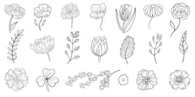
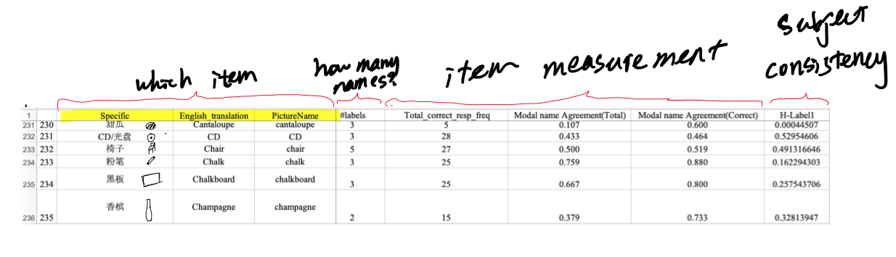
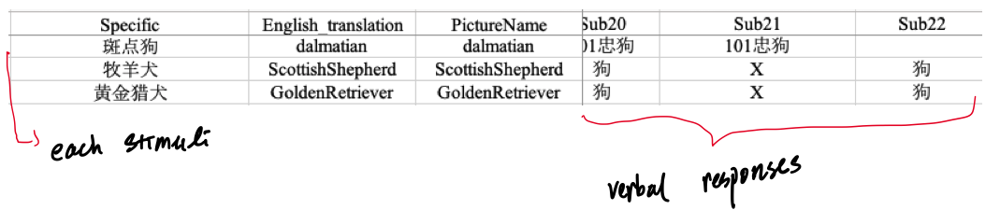

## **What we want**

### **The problem**

In English, individual flowers are usually named with specific name of that flower (e.g., rose, tulip). However, in Chinese flowers are usually named by both the basic level name (e.g., rose, tulip) followed by subordinate level name (花, flower). For example, chamomile is named 菊花 or chamomile flower. Therefore, it's possible that Chinese native speakers categorize daily objects differently because how Chinese has built-in category information in the language. 

Here, we are interested in finding the priming effects of the language. First of all, we need a standardized bank of based on Chinese speakers in order to find the most representable objects inside each basic levle category (e.g., a typical dog species within dog, typical flower within flower)

## **What We Had**

#### A bank of stimuli 
First, we collected a bank of stimuli using daily objects. In the table below, each row is an picture representing a daily object. We want to know on average, if each item is named correctly and also consistenty among all the subjects.

#### Design experiment to observe verbal response 

An example stimuli

In the experiment, we asked each subject to name a total of 400 individual pictures of objects and collected over 30 subjects' verbal response to each picture, as well as how fast they name the object.

#### Measurements of individual items

For each item (picture), we calculated the following statistics: 
- Entropy 
- Average naming accuracy 
- Total number of different labels 
- Average response time

## **What We Found**

While this is still an ongoing project, we have established the bank of 285 individual pictures of daily animals and daily objects, each comes with the following information: 

- Standardized Chinese name 
- Corresponding English names 
- Item's basic semantic level
- Item's surordinate level
- Average Response time 
- Entropy

## **Future** 
If you are interested in collaboration, please contact halleycl at gmail dot com. We would love to have people use this stimuli bank! 