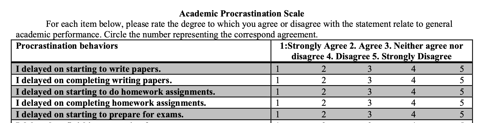

## **Motivation**

Most of the procrastination questionnaire is old, and subtypes of procrastination has been definied but not applied. While most people studied anxiety behind procrastination and rather used vague questions to ask individual subjects on their patterns of daily activity. I was interested in building a questionnaire specifically targeting college students. 

## **Questionnaire Construction**

#### **What the textbook says**

From Crocker & Algina's textbook :  *Introduction to Classical and Modern Test Theory*, they suggested the following steps when constructing a test.
1. Identify the primary purpose of the test score use 
2. Identify behaviors to represent the construct
    - content analysis
    - review of research
    - critical incident
    - direct observation
    - expert judgement 
    - instruction objectives
3. Domain sampling 
4. Item construction
5. Item review 

#### **How I wrote the questionnaire**
First of all, I want to know what it means exactly by procrastination. 

**1. Procrastination definition**

Procrastination is the unplanned delaying tasks and procrastinators often feel guilty about their procrastination. 

**2. Literature Research** 

Then, I wanted to know if any researchers has systematically studied procrastination. So I searched studies on academic procrastination and summarized their findings on procrastination.    

Specifically, procrastination can be divided into two categories.
- decisional procrastination
- behavioral procrastination. 

**3. Brain Storm**  

After studying about procrastination study, then I visualized what a procrastinator (like myself) would do in each category. 

Typical behaviors of procrastinators are: 
- missing deadlines
- making decisions until last minutes
- spend time on meaningless task before finishing task

Additionally, I included questions to ask about how individuals recognize their procrastination by asking question in these two additional categories. 
- how they feel about procrastination 
- the reasons for procrastinations 

## **My questionnaire**

The current questionnaire is a self-evaluating scale focused on behavioral and decisional procrastinations in daily life and academic, reasons of procrastinations and feelings about procrastinations. 

- Initially I had 50 items, then I analyzed the collected responses and end up with 25 items.
- 5-point likert scale 

#### **Population and sample**
I collected responses from 25 classmates in my psychometric class, which are all graduate students in academics so it fits my desired academic population.  

## **Measuring my questionnaire**

I used the following measurements to understand how effective my questionnaire is at evaluating people's internal states. 

- **Cohen's kappa** : Cohen's kappa measures the agreement between two raters who each classify N items into mutually exclusive categories. 
- **inter-rater agreement** : confidence of whether the cluster I assign it to other people also assign it to.

## **Potential Impact**

Procrastination scores were often related to lower self-regulations, lower self-efficacy, and higher neuroctism of personality trait. While most people would recognize procrastination as part of their personality, I hope this questionnaire would be their first step to identify specific behavior pattern and their general tendency to procrastination. 

## **Improvements**
Unfortunately, I lost the original collected data therefore cannot recover the measured statistics on individual items. This questionnaire was a psychometric class project and therefore hasn't been widely studied in a bigger subject pool. If I have an opportunity, I would specifically collect responses from undergraduate students and see how different the response is comparing to graduate students'. Also, this questionnaire was designed in 2014 and people probably procrastinate with different things with advances in technology in 2021 (2021 still sounds like future to me).

## **Resources**

If you are intersted in using my questionnaire, you can find the printable pdf here [(Procrastination Survey)](procrastinationscale.pdf).

