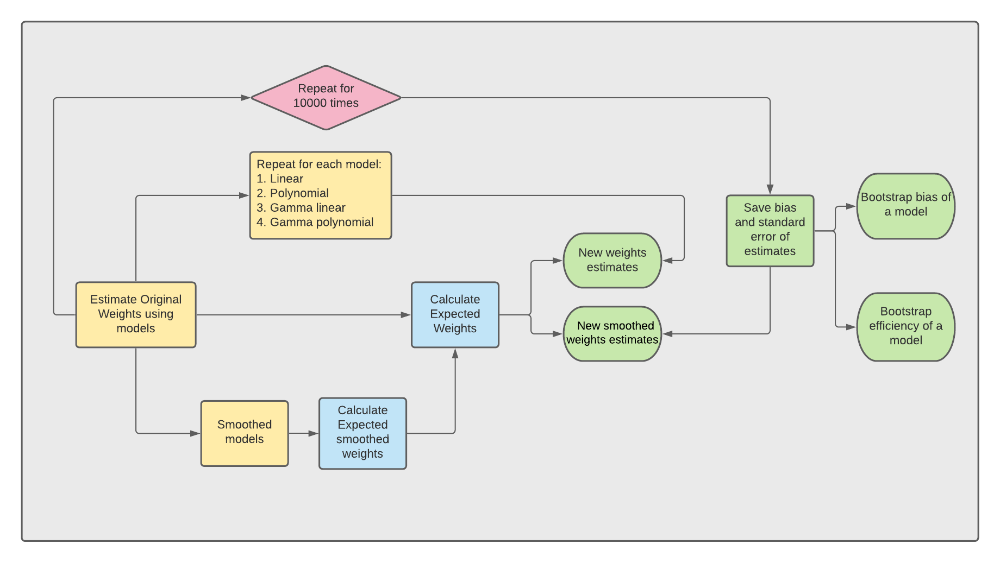
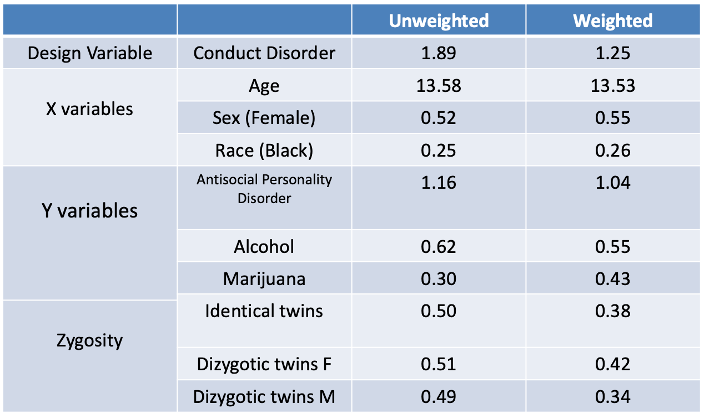
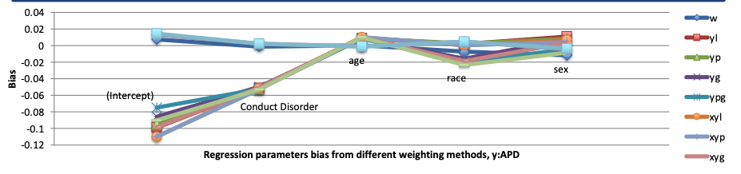
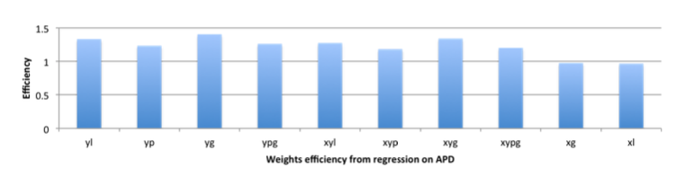

## **The problem**

The sampling problem: if we sample faithfully to the real subpopulation ratio within a population (the true random sampling strategy), then we might get unstable estimates. However, if we oversample in one subpopulation, then we have to correct for the oversampling. For example, autism twins are very rare. If we want to accurately measure their psychologycal assessments, we want to upsample by intentionally taking more measurements in autism twin pairs than we would if we stay true to the ratio of autism twin pairs to normal twin pairs.

Here, RDoC Study (2010-2012) Subsampling of Twin Pairs With Unequal Probability was a health survey on functional and structural neuroimaging and psychological assessments. They used a power strategy and took more samples in autism twin pairs.

My problem here is to pick a statistical strategy to estimate the true weights so the researchers can apply on their measurements to achieve both efficient and unbiased analysis.

## **Approach**

#### **Models to estimate weights**
Current study looks at different ways to calculate sample weights and compare their performances on the current dataset. Here, linear regression, polynomial regression, gamma linear regression, and gamma polynomial regression were used to estimate weights. 

#### **Bootstrapping to evaluate model performance**
10000 times bootstrapping were performed to evaluate how different models performed in estimating weights. 

#### **Measurements of model performance**

- **Efficiency** : Ratio of standard deviation of bootstrapped original weights comparing to 
bootstrapped weights based on various methods described above. This is telling us how our newly estimated weights varied comparing to original weights.  
  

- **Bias** : Difference between average bootstrapped estimates. Here, it is the difference between original weights to bootstrapped weights based on methods described above. This is telling us how different our newly estimated weights comparing to original weights.

## **Results**

**1. Were the parameters biased?**

The table below indicated that the parameter estimates were close to it's original estimates.

Also, across all the models, bias of different estimates (age, race, etc.,) were around zero. 

**2. Were the estimated weights efficient?**

Here,  yg and xyg model, which was gamma modeling of unsmoothed and smoothed sampling weights had the highest efficiency in estimating weights.

## **Conclusion**
While all the models used above can estimate accuracte weights, Gamma and linear models using either un-smoothed or smoothed estimates have the highest efficiency in estimating weights. 

## **Resource**
You can find the R code to do this analysis in my github respoitory.