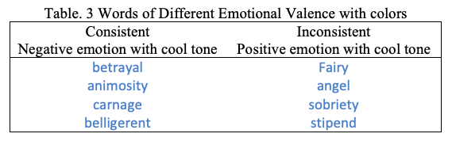
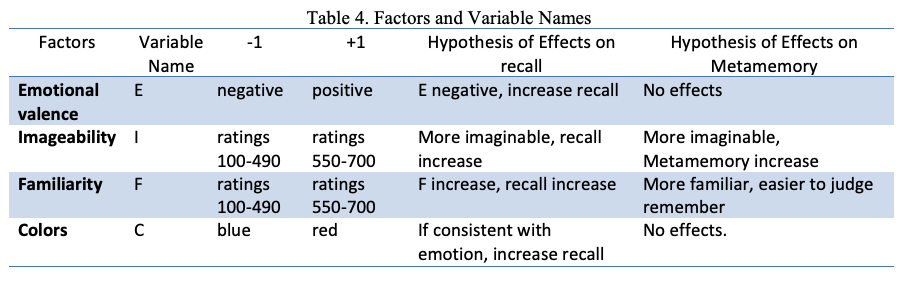
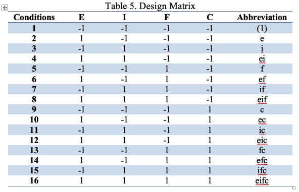
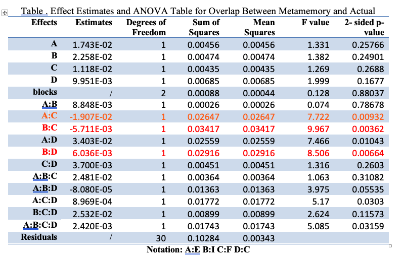
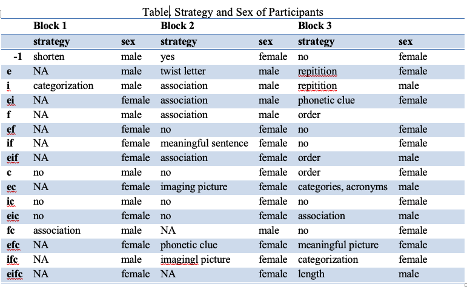

## **The Problem**

Past studies already demonstrate strong emotional content of words improves people’s immediate recall memory and consistent colors further enhance memory(Donald et al., 2004).  It is interesting to see if same conclusion can be draw on metamemory and whether the color still interacts with emotion. If so, we can say this effect is immediate and on-line.

Besides looking at people’s memory ability, we can also look at how people recognize this cognitive ability. Metacognition is “thinking of thinking”. Metamemory is the introspective cognition about one’s own memory ability. It is a self-judgment. While people’s natural memory capacity would restrain number of words actually remembered, words’ attributes may have larger effect on decision of one’s judgment of memory ability.

One hypothesis of current study is participants will remember more words when words are more familiar or easier to imagine. However, participants may not consider themselves remember (metamemory) more imaginable words but they will for more familiar words, for the reason that imageability is not very easy to identify at first impression. The current paper studies how four attributes—imageability, familiarity, emotional valence and associated colors—affect people’s ability to remember words.

Factorial design is an efficient way to design experiment to quickly investigate individual variable effects, as well as the ability to study interaction effects between variables. Here I will used factorial design with repeated measure to understand the following questions. 

Hypothesis: 

1. How word's properties influence human memory ability? 

2. How does individual word's properties influence the differences in metacognition and recall? 

Example stimuli of emotional valence and color variable. Each participant received a list of 20 words and ask to remember them. 

## **Experimental Design**

#### Independent Variables 
Here I used 4X3 repeated measure design to study the following effects both individually and also their interactions. 

- Emotional Valence 
- Imageability
- Familiarity
- Colors 

#### Design

Specific design here is a full factorial design. Words’ order in each list was completely randomized. Each condition was replicated three times (three blocks) and each block contained completely randomized orders of 16 trials.

#### **Measurements of memory**
- **meta-memory** : number of words they think they will remember. This measured subjects's metacognition of self memory.

- **actual recall** : number of words actually written down correctly. This is used to compare with meta-memory.

## **What I found**

While individual ANOVA analysis of response variable _recall_, or _meta\-cognition_ has not shown any significant effect dependent on words' properties. I further only looked at words overlap between words subjects they thought they would remember, and also they actually recalled later. 

Here I found out three $\rho < 0.01$ interaction effects on the items subjects both thought they would remember, and also they actually recalled: 
- Imageability and familarity
- Imageability and colors
- Emotional valence and familarity 

Here it indicated that more imagenable and familiar words lead to better memory and also made deeper impression both consciously (through meta-cognition) and also subconsciously (recall). 

#### **Participants characteristics by Condition**

I additionally analyze how the participants use to remember words. 
1. Participants used at least one strategy (9.33) remember more than participants used no strategy at all (8.125).
2. Most participants used strategies such as association, twist letter, phonetic clues to remember words. 

[//]: <> 

## **Conclusion**
English words with following properties made more impression: 

- Familiar words
- Negative words
- Emotional words 

Also, words in cooler colors allowed subjects to imagine those words more easily, therefore possibly increasing their memory on those words. Additionally, using a strategy was important to recall english words.

## **Resource**
My code to analyze the experiment data can be found here [(R Markdown file)](project.Rmd) and also on my github repository. If you want to replicate this experiment yourself, here is the materials [(Wordlist.pdf)](wordlist.pdf) I used to conduct this experiment. 
